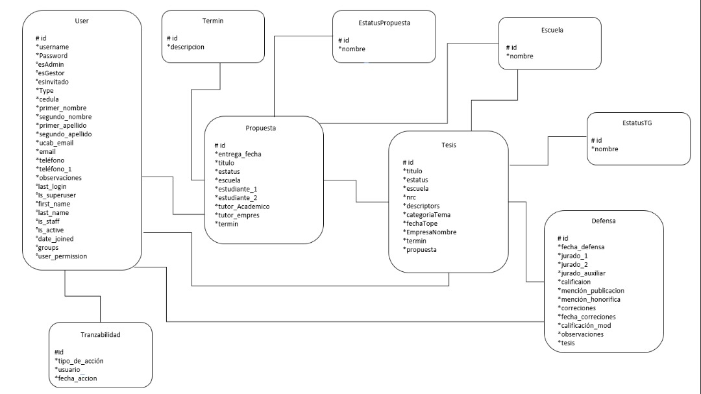

Introducción
==================

Nombre del aplicativo
^^^^^^^^^^^^^^^^^^^^^

GestorAppTG

Integrantes
^^^^^^^^^^^^

.. toctree::
    :maxdepth: 2

•	Ysabel Ardila --> ysabelardila
•	José Barrientos --> Joseeli54
•	Herick Navarro --> herick1
•	Jorge Viloria --> javiloria

Dirección del repositorio
^^^^^^^^^^^^^^^^^^^^^^^^^

https://github.com/javiloria/proyecto2python.git

Proposito
^^^^^^^^^^

Este documento cumple con el propósito de:

- Definir de manera precisa las funcionalidades y restricciones del sistema a desarrollar.

- Definir el sistema a los usuarios finales.

Ámbito del sistema
^^^^^^^^^^^^^^^^^^

Este proyecto se denomina "GestorAppTG". Esta aplicación se desarrollara con la finalidad de ser un 
sistema de gestion de trabajos de grado para todas las escuela de Ingeniería de la Universidad 
Católica Andrés Bello

Diagrama Entidad-Relación
^^^^^^^^^^^^^^^^^^^^^^^^^^^^

Visión general del documento
^^^^^^^^^^^^^^^^^^^^^^^^^^^^^

El presente documento consta de 6 partes:

• Introducción: En este apartado se definió los ámbitos generales del documento y del proyecto, para tener claro en que consiste el mismo.

• Ejecutar proyecto: Este punto, es un tutorial paso a paso de cómo realizar la ejecución del aplicativo.

• Pantallas del proyecto: En este apartado se definirán las pantallas del aplicativo, de manera que sea utilizado como manual o de referencia a la hora de utilizarlo.

• credenciales predeterminadas: En este apartado se definirá el estandar de las contraseñas y los usuarios basicos del aplicativo.

• Funcionalidad adicional: En este apartado se definirá la funcionalidades extras para puntos de participación.

• Generar documentación: En este apartado se explica un pequeño tutorial de las 2 formas de ejecutar la documentación de readthedocs.